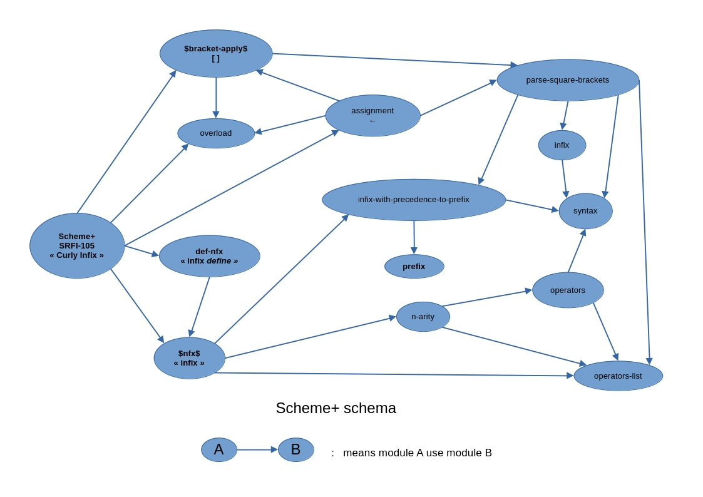

Scheme+ for Racket R6RS


Install as a package with the package manager.

Use in an R6RS module:

```(import Scheme+R6RS)```

Designed to use with [SRFI 105 Curly Infix reader for Racket](https://github.com/damien-mattei/SRFI-105-for-Racket).



[See general documentation of Scheme+](https://github.com/damien-mattei/Scheme-PLUS-for-Racket/blob/gh-pages/README.md)

A full [graphic and plotting example](https://github.com/damien-mattei/Scheme-PLUS-for-Racket-R6RS/blob/main/examples/chaos%2B.rkt) of Scheme+ and SRFI-105 Curly Infix with Racket/R6RS about [Chaos Theory](https://en.wikipedia.org/wiki/Chaos_theory).

